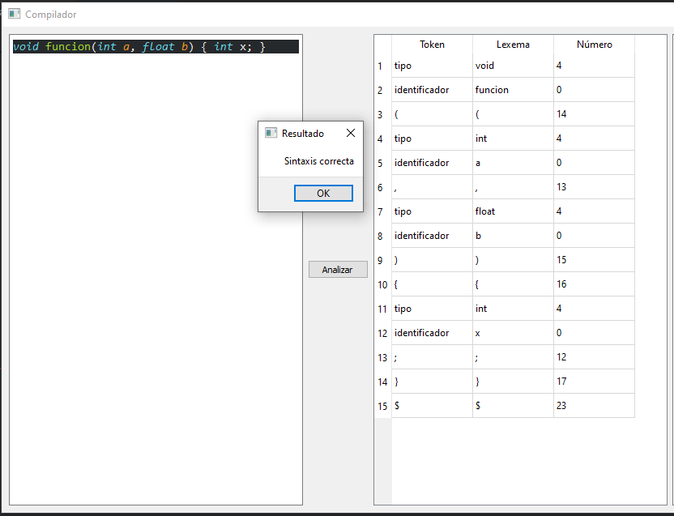
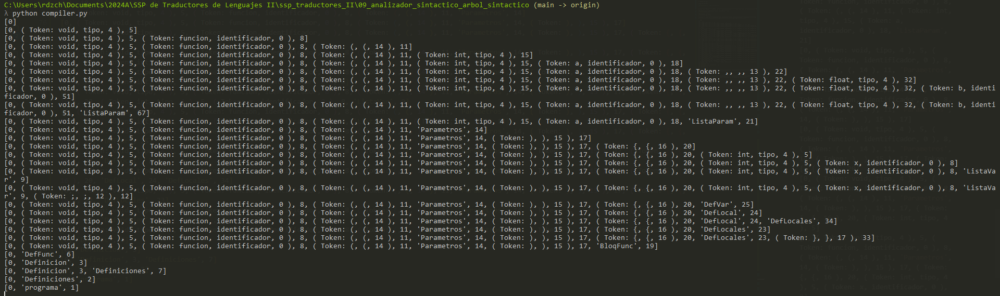
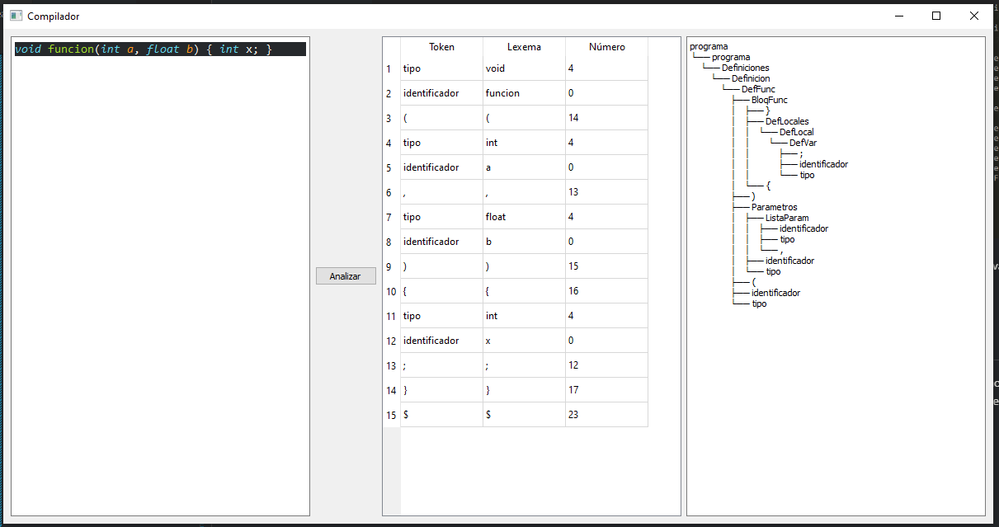

# Compilador: Fase de Generación de Arbol de Análisis Sintáctico

## Dependencias del Programa

El proyecto utiliza las siguientes bibliotecas de Python:

- `pandas`: Para manejar tablas de análisis sintáctico.
- `PyQt5`: Para la interfaz gráfica de usuario.
- `anytree`: Para construir y manipular el árbol de análisis.

Para instalar estas bibliotecas y asegurarse del correcto funcionamiento del programa, ejecutamos el siguiente comando en la terminal:
```bash
pip install pandas PyQt5 anytree
```

## Componentes clave

### Tabla de Símbolos y Tokens

- **Tabla de Símbolos (`tabla_simbolos`)**: Un diccionario que mapea símbolos y constructos del lenguaje a sus roles y precedencia en el análisis sintáctico.
- **Tokens (clase `Token`)**: Representa un token léxico con atributos para el lexema, su tipo de símbolo y precedencia asociada.

### Tokenizador (función `obtener_tokens`)

Esta función escanea el código de entrada para generar una lista de tokens basada en la sintaxis léxica del lenguaje C. Identifica diferentes tipos de tokens como identificadores, palabras clave, números y operadores.

### Analizador Sintáctico (función `analizar`)

Esta función realiza el análisis sintáctico utilizando un enfoque de tabla de análisis basada en pilas. Lee tokens, aplica reglas gramaticales y gestiona la pila de análisis para validar la sintaxis y construir el árbol de análisis.

### Árbol de Análisis

Construido usando la biblioteca `anytree`, el árbol de análisis representa visualmente la estructura del código analizado, mostrando la disposición jerárquica de los constructos del lenguaje.

### GUI (clase `TokenizerWindow`)

La interfaz gráfica de usuario, construida con `PyQt5`, permite a los usuarios ingresar código C, iniciar el análisis y ver los tokens y el árbol de análisis resultante o mensajes de error.

## Ejecución del Compilador

La entrada principal de la aplicación (función `main`) inicializa la GUI, permitiendo la interacción con el compilador. Para ejecutar el compilador, ejecutamos el script:
```bash
python compiler.py
```

## Ejemplo de Uso

Cadena de Entrada:
```c
void funcion(int a, float b) { int x; }
```

Esta entrada tokenizará el código, analizará su sintaxis y mostrará el árbol de análisis si la sintaxis es correcta, o un mensaje de error en caso contrario.

### Ingreso de la cadena de entrada en la interfaz gráfica:


### Obtención de Tokens:


Obtenemos los tokens de la cadena de entrada, mostrando el lexema, el tipo de símbolo y la precedencia asociada. Inmediateamente se realiza el analisis sintáctico, en este caso se muestra un mensaje que indica que la cadena de entrada es válida.

### Analisis Sintáctico y Árbol de Análisis:


Además se muestra la cola del proceso de análisis sintáctico de la cadena de entrada dentro de la terminal. En este caso, la cadena de entrada es válida y la ultima reducción es la regla `programa -> Definiciones`.

### Impresión del Árbol de Análisis:



Por  último, se muestra el árbol de análisis de la cadena de entrada en la interfaz gráfica. El árbol de análisis muestra la estructura jerárquica del código analizado, con nodos para cada regla gramatical aplicada.

Podemos ver el arbol de análisis de mejor manera aquí:

```plaintext
programa
└── programa
    └── Definiciones
        └── Definicion
            └── DefFunc
                ├── BloqFunc
                │   ├── }
                │   ├── DefLocales
                │   │   └── DefLocal
                │   │       └── DefVar
                │   │           ├── ;
                │   │           ├── identificador
                │   │           └── tipo
                │   └── {
                ├── )
                ├── Parametros
                │   ├── ListaParam
                │   │   ├── identificador
                │   │   ├── tipo
                │   │   └── ,
                │   ├── identificador
                │   └── tipo
                ├── (
                ├── identificador
                └── tipo
```

Los terminales se muestran en orden de arriba hacia abajo.


## Mejoras a futuro

- **Pruebas con cadena de entrada más complejas y largas**: Realizar pruebas con cadenas de entrada más complejas y largas para evaluar la eficiencia y precisión del analizador sintáctico, ya que de momento solo se han realizado pruebas con cadenas de entrada simples. Pero en este punto sólo se requerirá solucionar pequeños errores para solucionar los problemas que se presenten.

- **Mejoras en la interfaz gráfica**: Mejorar la interfaz gráfica para hacerla más intuitiva y fácil de usar, permitiendo una mejor visualización de los resultados del análisis sintáctico.

- **Impresión más comprensilbe del árbol de análisis**: Mejorar la impresión del árbol de análisis para hacerlo más comprensible y fácil de interpretar, permitiendo una visualización más clara de la estructura del código. En este caso me gustaría poder mostrar los terminales en orden de arriba a abajo para que se puedan leer mejor. Además, podría mostrar el id y el tipo de dato asignado a cada nodo para que en el analisis semántico se pueda hacer de manera más sencilla.

- **Manejo de errores aún no identificados**: Me gustaría hacer más pruebas para identificar errores en cada fase del compilador y poder solucionarlos.