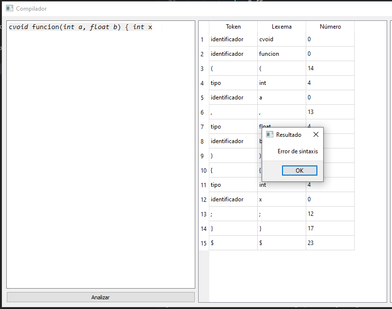

# Compilador: Fase de Generación de Arbol de Análisis Sintáctico

## Dependencias del Programa

El proyecto utiliza las siguientes bibliotecas de Python:

- `pandas`: Para manejar tablas de análisis sintáctico.
- `PyQt5`: Para la interfaz gráfica de usuario.
- `anytree`: Para construir y manipular el árbol de análisis.

Para instalar estas bibliotecas y asegurarse del correcto funcionamiento del programa, ejecutamos el siguiente comando en la terminal:
```bash
pip install pandas PyQt5 anytree
```

## Componentes clave

### Tabla de Símbolos y Tokens

- **Tabla de Símbolos (`tabla_simbolos`)**: Un diccionario que mapea símbolos y constructos del lenguaje a sus roles y precedencia en el análisis sintáctico.
- **Tokens (clase `Token`)**: Representa un token léxico con atributos para el lexema, su tipo de símbolo y precedencia asociada.

### Tokenizador (función `obtener_tokens`)

Esta función escanea el código de entrada para generar una lista de tokens basada en la sintaxis léxica del lenguaje C. Identifica diferentes tipos de tokens como identificadores, palabras clave, números y operadores.

### Analizador Sintáctico (función `analizar`)

Esta función realiza el análisis sintáctico utilizando un enfoque de tabla de análisis basada en pilas. Lee tokens, aplica reglas gramaticales y gestiona la pila de análisis para validar la sintaxis y construir el árbol de análisis.

### Árbol de Análisis

Construido usando la biblioteca `anytree`, el árbol de análisis representa visualmente la estructura del código analizado, mostrando la disposición jerárquica de los constructos del lenguaje.

### GUI (clase `TokenizerWindow`)

La interfaz gráfica de usuario, construida con `PyQt5`, permite a los usuarios ingresar código C, iniciar el análisis y ver los tokens y el árbol de análisis resultante o mensajes de error.

## Ejecución del Compilador

La entrada principal de la aplicación (función `main`) inicializa la GUI, permitiendo la interacción con el compilador. Para ejecutar el compilador, ejecutamos el script:
```bash
python compiler.py
```

## Ejemplos de Uso

El compilador tokenizará el código, analizará su sintaxis y mostrará el árbol de análisis si la sintaxis es correcta, o un mensaje de error en caso contrario.

### Ingreso de la cadena de entrada en la interfaz gráfica:


### Obtención de Tokens:


Obtenemos los tokens de la cadena de entrada, mostrando el lexema, el tipo de símbolo y la precedencia asociada. Inmediateamente se realiza el analisis sintáctico, en este caso se muestra un mensaje que indica que la cadena de entrada es válida.

### Analisis Sintáctico y Árbol de Análisis:


Además se muestra la cola del proceso de análisis sintáctico de la cadena de entrada dentro de la terminal. En este caso, la cadena de entrada es válida y la ultima reducción es la regla `programa -> Definiciones`.

### Impresión del Árbol de Análisis:


Por  último, se muestra el árbol de análisis de la cadena de entrada en la interfaz gráfica. El árbol de análisis muestra la estructura jerárquica del código analizado, con nodos para cada regla gramatical aplicada.

Podemos ver el arbol de análisis de mejor manera aquí:

```plaintext
programa
└── programa
    └── Definiciones
        └── Definicion
            └── DefFunc
                ├── BloqFunc
                │   ├── }
                │   ├── DefLocales
                │   │   └── DefLocal
                │   │       └── DefVar
                │   │           ├── ;
                │   │           ├── identificador
                │   │           └── tipo
                │   └── {
                ├── )
                ├── Parametros
                │   ├── ListaParam
                │   │   ├── identificador
                │   │   ├── tipo
                │   │   └── ,
                │   ├── identificador
                │   └── tipo
                ├── (
                ├── identificador
                └── tipo
```

Los terminales se muestran en orden de arriba hacia abajo.

### Mensaje de Error:



Cuando la cadena de entrada no es válida, se muestra un mensaje de error en la interfaz gráfica, indicando el token que causó el error y la posición en la cadena de entrada.

## Otras Pruebas

### Código 1:

```c
int a;
    int suma(int a, int b){
    return a+b;
}

int main(){
    float a;
    int b;
    int c;
    c = a+b;
    c = suma(8,9);
}
```
### Arbol Resultante:

```plaintext
programa
└── programa
    └── Definiciones
        ├── Definiciones
        │   ├── Definiciones
        │   │   └── Definicion
        │   │       └── DefFunc
        │   │           ├── BloqFunc
        │   │           │   ├── }
        │   │           │   ├── DefLocales
        │   │           │   │   ├── DefLocales
        │   │           │   │   │   ├── DefLocales
        │   │           │   │   │   │   ├── DefLocales
        │   │           │   │   │   │   │   ├── DefLocales
        │   │           │   │   │   │   │   │   └── DefLocal
        │   │           │   │   │   │   │   │       └── Sentencia
        │   │           │   │   │   │   │   │           ├── ;
        │   │           │   │   │   │   │   │           ├── Expresion
        │   │           │   │   │   │   │   │           │   └── Termino
        │   │           │   │   │   │   │   │           │       └── LlamadaFunc
        │   │           │   │   │   │   │   │           │           ├── )
        │   │           │   │   │   │   │   │           │           ├── Argumentos
        │   │           │   │   │   │   │   │           │           │   ├── ListaArgumentos
        │   │           │   │   │   │   │   │           │           │   │   ├── Expresion
        │   │           │   │   │   │   │   │           │           │   │   │   └── Termino
        │   │           │   │   │   │   │   │           │           │   │   │       └── 9
        │   │           │   │   │   │   │   │           │           │   │   └── ,
        │   │           │   │   │   │   │   │           │           │   └── Expresion
        │   │           │   │   │   │   │   │           │           │       └── Termino
        │   │           │   │   │   │   │   │           │           │           └── 8
        │   │           │   │   │   │   │   │           │           ├── (
        │   │           │   │   │   │   │   │           │           └── suma
        │   │           │   │   │   │   │   │           ├── =
        │   │           │   │   │   │   │   │           └── c
        │   │           │   │   │   │   │   └── DefLocal
        │   │           │   │   │   │   │       └── Sentencia
        │   │           │   │   │   │   │           ├── ;
        │   │           │   │   │   │   │           ├── Expresion
        │   │           │   │   │   │   │           │   ├── Expresion
        │   │           │   │   │   │   │           │   │   └── Termino
        │   │           │   │   │   │   │           │   │       └── b
        │   │           │   │   │   │   │           │   ├── +
        │   │           │   │   │   │   │           │   └── Expresion
        │   │           │   │   │   │   │           │       └── Termino
        │   │           │   │   │   │   │           │           └── a
        │   │           │   │   │   │   │           ├── =
        │   │           │   │   │   │   │           └── c
        │   │           │   │   │   │   └── DefLocal
        │   │           │   │   │   │       └── DefVar
        │   │           │   │   │   │           ├── ;
        │   │           │   │   │   │           ├── c
        │   │           │   │   │   │           └── int
        │   │           │   │   │   └── DefLocal
        │   │           │   │   │       └── DefVar
        │   │           │   │   │           ├── ;
        │   │           │   │   │           ├── b
        │   │           │   │   │           └── int
        │   │           │   │   └── DefLocal
        │   │           │   │       └── DefVar
        │   │           │   │           ├── ;
        │   │           │   │           ├── a
        │   │           │   │           └── float
        │   │           │   └── {
        │   │           ├── )
        │   │           ├── (
        │   │           ├── main
        │   │           └── int
        │   └── Definicion
        │       └── DefFunc
        │           ├── BloqFunc
        │           │   ├── }
        │           │   ├── DefLocales
        │           │   │   └── DefLocal
        │           │   │       └── Sentencia
        │           │   │           ├── ;
        │           │   │           ├── ValorRegresa
        │           │   │           │   └── Expresion
        │           │   │           │       ├── Expresion
        │           │   │           │       │   └── Termino
        │           │   │           │       │       └── b
        │           │   │           │       ├── +
        │           │   │           │       └── Expresion
        │           │   │           │           └── Termino
        │           │   │           │               └── a
        │           │   │           └── return
        │           │   └── {
        │           ├── )
        │           ├── Parametros
        │           │   ├── ListaParam
        │           │   │   ├── b
        │           │   │   ├── int
        │           │   │   └── ,
        │           │   ├── a
        │           │   └── int
        │           ├── (
        │           ├── suma
        │           └── int
        └── Definicion
            └── DefVar
                ├── ;
                ├── a
                └── int
```
### Código 2:

```c
int var1, var2, var3, var4, var5; 

float calcularPromedio(int a, int b, int c, int d, int e) { 
    int suma;
    suma = a + b + c + d + e; 
    float promedio;
    promedio = suma / 5.0; 
    return promedio; 
}

float calcularVarianza(int a, int b, int c, int d, int e, float promedio) { 
    float varianza; 
    varianza= ((a - promedio) * (a - promedio) + (b - promedio) * (b - promedio) + (c - promedio) * (c - promedio) + (d - promedio) * (d - promedio) + (e - promedio) * (e - promedio)) / 5.0; 
    return varianza; 
}
```
### Arbol Resultante:

```plaintext
programa
└── programa
    └── Definiciones
        ├── Definiciones
        │   ├── Definiciones
        │   │   └── Definicion
        │   │       └── DefFunc
        │   │           ├── BloqFunc
        │   │           │   ├── }
        │   │           │   ├── DefLocales
        │   │           │   │   ├── DefLocales
        │   │           │   │   │   ├── DefLocales
        │   │           │   │   │   │   └── DefLocal
        │   │           │   │   │   │       └── Sentencia
        │   │           │   │   │   │           ├── ;
        │   │           │   │   │   │           ├── ValorRegresa
        │   │           │   │   │   │           │   └── Expresion
        │   │           │   │   │   │           │       └── Termino
        │   │           │   │   │   │           │           └── varianza
        │   │           │   │   │   │           └── return
        │   │           │   │   │   └── DefLocal
        │   │           │   │   │       └── Sentencia
        │   │           │   │   │           ├── ;
        │   │           │   │   │           ├── Expresion
        │   │           │   │   │           │   ├── Expresion
        │   │           │   │   │           │   │   └── Termino
        │   │           │   │   │           │   │       └── 5.0
        │   │           │   │   │           │   ├── /
        │   │           │   │   │           │   └── Expresion
        │   │           │   │   │           │       ├── )
        │   │           │   │   │           │       ├── Expresion
        │   │           │   │   │           │       │   ├── Expresion
        │   │           │   │   │           │       │   │   ├── Expresion
        │   │           │   │   │           │       │   │   │   ├── )
        │   │           │   │   │           │       │   │   │   ├── Expresion
        │   │           │   │   │           │       │   │   │   │   ├── Expresion
        │   │           │   │   │           │       │   │   │   │   │   └── Termino
        │   │           │   │   │           │       │   │   │   │   │       └── promedio
        │   │           │   │   │           │       │   │   │   │   ├── -
        │   │           │   │   │           │       │   │   │   │   └── Expresion
        │   │           │   │   │           │       │   │   │   │       └── Termino
        │   │           │   │   │           │       │   │   │   │           └── e
        │   │           │   │   │           │       │   │   │   └── (
        │   │           │   │   │           │       │   │   ├── *
        │   │           │   │   │           │       │   │   └── Expresion
        │   │           │   │   │           │       │   │       ├── )
        │   │           │   │   │           │       │   │       ├── Expresion
        │   │           │   │   │           │       │   │       │   ├── Expresion
        │   │           │   │   │           │       │   │       │   │   └── Termino
        │   │           │   │   │           │       │   │       │   │       └── promedio
        │   │           │   │   │           │       │   │       │   ├── -
        │   │           │   │   │           │       │   │       │   └── Expresion
        │   │           │   │   │           │       │   │       │       └── Termino
        │   │           │   │   │           │       │   │       │           └── e
        │   │           │   │   │           │       │   │       └── (
        │   │           │   │   │           │       │   ├── +
        │   │           │   │   │           │       │   └── Expresion
        │   │           │   │   │           │       │       ├── Expresion
        │   │           │   │   │           │       │       │   ├── Expresion
        │   │           │   │   │           │       │       │   │   ├── )
        │   │           │   │   │           │       │       │   │   ├── Expresion
        │   │           │   │   │           │       │       │   │   │   ├── Expresion
        │   │           │   │   │           │       │       │   │   │   │   └── Termino
        │   │           │   │   │           │       │       │   │   │   │       └── promedio
        │   │           │   │   │           │       │       │   │   │   ├── -
        │   │           │   │   │           │       │       │   │   │   └── Expresion
        │   │           │   │   │           │       │       │   │   │       └── Termino
        │   │           │   │   │           │       │       │   │   │           └── d
        │   │           │   │   │           │       │       │   │   └── (
        │   │           │   │   │           │       │       │   ├── *
        │   │           │   │   │           │       │       │   └── Expresion
        │   │           │   │   │           │       │       │       ├── )
        │   │           │   │   │           │       │       │       ├── Expresion
        │   │           │   │   │           │       │       │       │   ├── Expresion
        │   │           │   │   │           │       │       │       │   │   └── Termino
        │   │           │   │   │           │       │       │       │   │       └── promedio
        │   │           │   │   │           │       │       │       │   ├── -
        │   │           │   │   │           │       │       │       │   └── Expresion
        │   │           │   │   │           │       │       │       │       └── Termino
        │   │           │   │   │           │       │       │       │           └── d
        │   │           │   │   │           │       │       │       └── (
        │   │           │   │   │           │       │       ├── +
        │   │           │   │   │           │       │       └── Expresion
        │   │           │   │   │           │       │           ├── Expresion
        │   │           │   │   │           │       │           │   ├── Expresion
        │   │           │   │   │           │       │           │   │   ├── )
        │   │           │   │   │           │       │           │   │   ├── Expresion
        │   │           │   │   │           │       │           │   │   │   ├── Expresion
        │   │           │   │   │           │       │           │   │   │   │   └── Termino
        │   │           │   │   │           │       │           │   │   │   │       └── promedio
        │   │           │   │   │           │       │           │   │   │   ├── -
        │   │           │   │   │           │       │           │   │   │   └── Expresion
        │   │           │   │   │           │       │           │   │   │       └── Termino
        │   │           │   │   │           │       │           │   │   │           └── c
        │   │           │   │   │           │       │           │   │   └── (
        │   │           │   │   │           │       │           │   ├── *
        │   │           │   │   │           │       │           │   └── Expresion
        │   │           │   │   │           │       │           │       ├── )
        │   │           │   │   │           │       │           │       ├── Expresion
        │   │           │   │   │           │       │           │       │   ├── Expresion
        │   │           │   │   │           │       │           │       │   │   └── Termino
        │   │           │   │   │           │       │           │       │   │       └── promedio
        │   │           │   │   │           │       │           │       │   ├── -
        │   │           │   │   │           │       │           │       │   └── Expresion
        │   │           │   │   │           │       │           │       │       └── Termino
        │   │           │   │   │           │       │           │       │           └── c
        │   │           │   │   │           │       │           │       └── (
        │   │           │   │   │           │       │           ├── +
        │   │           │   │   │           │       │           └── Expresion
        │   │           │   │   │           │       │               ├── Expresion
        │   │           │   │   │           │       │               │   ├── Expresion
        │   │           │   │   │           │       │               │   │   ├── )
        │   │           │   │   │           │       │               │   │   ├── Expresion
        │   │           │   │   │           │       │               │   │   │   ├── Expresion
        │   │           │   │   │           │       │               │   │   │   │   └── Termino
        │   │           │   │   │           │       │               │   │   │   │       └── promedio
        │   │           │   │   │           │       │               │   │   │   ├── -
        │   │           │   │   │           │       │               │   │   │   └── Expresion
        │   │           │   │   │           │       │               │   │   │       └── Termino
        │   │           │   │   │           │       │               │   │   │           └── b
        │   │           │   │   │           │       │               │   │   └── (
        │   │           │   │   │           │       │               │   ├── *
        │   │           │   │   │           │       │               │   └── Expresion
        │   │           │   │   │           │       │               │       ├── )
        │   │           │   │   │           │       │               │       ├── Expresion
        │   │           │   │   │           │       │               │       │   ├── Expresion
        │   │           │   │   │           │       │               │       │   │   └── Termino
        │   │           │   │   │           │       │               │       │   │       └── promedio
        │   │           │   │   │           │       │               │       │   ├── -
        │   │           │   │   │           │       │               │       │   └── Expresion
        │   │           │   │   │           │       │               │       │       └── Termino
        │   │           │   │   │           │       │               │       │           └── b
        │   │           │   │   │           │       │               │       └── (
        │   │           │   │   │           │       │               ├── +
        │   │           │   │   │           │       │               └── Expresion
        │   │           │   │   │           │       │                   ├── Expresion
        │   │           │   │   │           │       │                   │   ├── )
        │   │           │   │   │           │       │                   │   ├── Expresion
        │   │           │   │   │           │       │                   │   │   ├── Expresion
        │   │           │   │   │           │       │                   │   │   │   └── Termino
        │   │           │   │   │           │       │                   │   │   │       └── promedio
        │   │           │   │   │           │       │                   │   │   ├── -
        │   │           │   │   │           │       │                   │   │   └── Expresion
        │   │           │   │   │           │       │                   │   │       └── Termino
        │   │           │   │   │           │       │                   │   │           └── a
        │   │           │   │   │           │       │                   │   └── (
        │   │           │   │   │           │       │                   ├── *
        │   │           │   │   │           │       │                   └── Expresion
        │   │           │   │   │           │       │                       ├── )
        │   │           │   │   │           │       │                       ├── Expresion
        │   │           │   │   │           │       │                       │   ├── Expresion
        │   │           │   │   │           │       │                       │   │   └── Termino
        │   │           │   │   │           │       │                       │   │       └── promedio
        │   │           │   │   │           │       │                       │   ├── -
        │   │           │   │   │           │       │                       │   └── Expresion
        │   │           │   │   │           │       │                       │       └── Termino
        │   │           │   │   │           │       │                       │           └── a
        │   │           │   │   │           │       │                       └── (
        │   │           │   │   │           │       └── (
        │   │           │   │   │           ├── =
        │   │           │   │   │           └── varianza
        │   │           │   │   └── DefLocal
        │   │           │   │       └── DefVar
        │   │           │   │           ├── ;
        │   │           │   │           ├── varianza
        │   │           │   │           └── float
        │   │           │   └── {
        │   │           ├── )
        │   │           ├── Parametros
        │   │           │   ├── ListaParam
        │   │           │   │   ├── ListaParam
        │   │           │   │   │   ├── ListaParam
        │   │           │   │   │   │   ├── ListaParam
        │   │           │   │   │   │   │   ├── ListaParam
        │   │           │   │   │   │   │   │   ├── promedio
        │   │           │   │   │   │   │   │   ├── float
        │   │           │   │   │   │   │   │   └── ,
        │   │           │   │   │   │   │   ├── e
        │   │           │   │   │   │   │   ├── int
        │   │           │   │   │   │   │   └── ,
        │   │           │   │   │   │   ├── d
        │   │           │   │   │   │   ├── int
        │   │           │   │   │   │   └── ,
        │   │           │   │   │   ├── c
        │   │           │   │   │   ├── int
        │   │           │   │   │   └── ,
        │   │           │   │   ├── b
        │   │           │   │   ├── int
        │   │           │   │   └── ,
        │   │           │   ├── a
        │   │           │   └── int
        │   │           ├── (
        │   │           ├── calcularVarianza
        │   │           └── float
        │   └── Definicion
        │       └── DefFunc
        │           ├── BloqFunc
        │           │   ├── }
        │           │   ├── DefLocales
        │           │   │   ├── DefLocales
        │           │   │   │   ├── DefLocales
        │           │   │   │   │   ├── DefLocales
        │           │   │   │   │   │   ├── DefLocales
        │           │   │   │   │   │   │   └── DefLocal
        │           │   │   │   │   │   │       └── Sentencia
        │           │   │   │   │   │   │           ├── ;
        │           │   │   │   │   │   │           ├── ValorRegresa
        │           │   │   │   │   │   │           │   └── Expresion
        │           │   │   │   │   │   │           │       └── Termino
        │           │   │   │   │   │   │           │           └── promedio
        │           │   │   │   │   │   │           └── return
        │           │   │   │   │   │   └── DefLocal
        │           │   │   │   │   │       └── Sentencia
        │           │   │   │   │   │           ├── ;
        │           │   │   │   │   │           ├── Expresion
        │           │   │   │   │   │           │   ├── Expresion
        │           │   │   │   │   │           │   │   └── Termino
        │           │   │   │   │   │           │   │       └── 5.0
        │           │   │   │   │   │           │   ├── /
        │           │   │   │   │   │           │   └── Expresion
        │           │   │   │   │   │           │       └── Termino
        │           │   │   │   │   │           │           └── suma
        │           │   │   │   │   │           ├── =
        │           │   │   │   │   │           └── promedio
        │           │   │   │   │   └── DefLocal
        │           │   │   │   │       └── DefVar
        │           │   │   │   │           ├── ;
        │           │   │   │   │           ├── promedio
        │           │   │   │   │           └── float
        │           │   │   │   └── DefLocal
        │           │   │   │       └── Sentencia
        │           │   │   │           ├── ;
        │           │   │   │           ├── Expresion
        │           │   │   │           │   ├── Expresion
        │           │   │   │           │   │   └── Termino
        │           │   │   │           │   │       └── e
        │           │   │   │           │   ├── +
        │           │   │   │           │   └── Expresion
        │           │   │   │           │       ├── Expresion
        │           │   │   │           │       │   └── Termino
        │           │   │   │           │       │       └── d
        │           │   │   │           │       ├── +
        │           │   │   │           │       └── Expresion
        │           │   │   │           │           ├── Expresion
        │           │   │   │           │           │   └── Termino
        │           │   │   │           │           │       └── c
        │           │   │   │           │           ├── +
        │           │   │   │           │           └── Expresion
        │           │   │   │           │               ├── Expresion
        │           │   │   │           │               │   └── Termino
        │           │   │   │           │               │       └── b
        │           │   │   │           │               ├── +
        │           │   │   │           │               └── Expresion
        │           │   │   │           │                   └── Termino
        │           │   │   │           │                       └── a
        │           │   │   │           ├── =
        │           │   │   │           └── suma
        │           │   │   └── DefLocal
        │           │   │       └── DefVar
        │           │   │           ├── ;
        │           │   │           ├── suma
        │           │   │           └── int
        │           │   └── {
        │           ├── )
        │           ├── Parametros
        │           │   ├── ListaParam
        │           │   │   ├── ListaParam
        │           │   │   │   ├── ListaParam
        │           │   │   │   │   ├── ListaParam
        │           │   │   │   │   │   ├── e
        │           │   │   │   │   │   ├── int
        │           │   │   │   │   │   └── ,
        │           │   │   │   │   ├── d
        │           │   │   │   │   ├── int
        │           │   │   │   │   └── ,
        │           │   │   │   ├── c
        │           │   │   │   ├── int
        │           │   │   │   └── ,
        │           │   │   ├── b
        │           │   │   ├── int
        │           │   │   └── ,
        │           │   ├── a
        │           │   └── int
        │           ├── (
        │           ├── calcularPromedio
        │           └── float
        └── Definicion
            └── DefVar
                ├── ;
                ├── ListaVar
                │   ├── ListaVar
                │   │   ├── ListaVar
                │   │   │   ├── ListaVar
                │   │   │   │   ├── var5
                │   │   │   │   └── ,
                │   │   │   ├── var4
                │   │   │   └── ,
                │   │   ├── var3
                │   │   └── ,
                │   ├── var2
                │   └── ,
                ├── var1
                └── int
```	

### Código 3:

```c
int max(int a, int b) { 
    if (a > b) { 
        return a; 
    } else { 
        return b; 
    } 
}
int factorial(int n) { 
    if (n == 0) { 
        return 1; 
    } else { 
        return n * factorial(n - 1); 
    } 
}
int main() { 
    int num1, num2;
    num1 = 5; 
    num2 = 10; 
    int m;
    m = max(num1, num2); 
    int f; 
    f = factorial(m); 
    return f; 
}
```

### Arbol Resultante:

```plaintext
programa
└── programa
    └── Definiciones
        ├── Definiciones
        │   ├── Definiciones
        │   │   └── Definicion
        │   │       └── DefFunc
        │   │           ├── BloqFunc
        │   │           │   ├── }
        │   │           │   ├── DefLocales
        │   │           │   │   ├── DefLocales
        │   │           │   │   │   ├── DefLocales
        │   │           │   │   │   │   ├── DefLocales
        │   │           │   │   │   │   │   ├── DefLocales
        │   │           │   │   │   │   │   │   ├── DefLocales
        │   │           │   │   │   │   │   │   │   ├── DefLocales
        │   │           │   │   │   │   │   │   │   │   ├── DefLocales
        │   │           │   │   │   │   │   │   │   │   │   └── DefLocal
        │   │           │   │   │   │   │   │   │   │   │       └── Sentencia
        │   │           │   │   │   │   │   │   │   │   │           ├── ;
        │   │           │   │   │   │   │   │   │   │   │           ├── ValorRegresa
        │   │           │   │   │   │   │   │   │   │   │           │   └── Expresion
        │   │           │   │   │   │   │   │   │   │   │           │       └── Termino
        │   │           │   │   │   │   │   │   │   │   │           │           └── f
        │   │           │   │   │   │   │   │   │   │   │           └── return
        │   │           │   │   │   │   │   │   │   │   └── DefLocal
        │   │           │   │   │   │   │   │   │   │       └── Sentencia
        │   │           │   │   │   │   │   │   │   │           ├── ;
        │   │           │   │   │   │   │   │   │   │           ├── Expresion
        │   │           │   │   │   │   │   │   │   │           │   └── Termino
        │   │           │   │   │   │   │   │   │   │           │       └── LlamadaFunc
        │   │           │   │   │   │   │   │   │   │           │           ├── )
        │   │           │   │   │   │   │   │   │   │           │           ├── Argumentos
        │   │           │   │   │   │   │   │   │   │           │           │   └── Expresion
        │   │           │   │   │   │   │   │   │   │           │           │       └── Termino
        │   │           │   │   │   │   │   │   │   │           │           │           └── m
        │   │           │   │   │   │   │   │   │   │           │           ├── (
        │   │           │   │   │   │   │   │   │   │           │           └── factorial
        │   │           │   │   │   │   │   │   │   │           ├── =
        │   │           │   │   │   │   │   │   │   │           └── f
        │   │           │   │   │   │   │   │   │   └── DefLocal
        │   │           │   │   │   │   │   │   │       └── DefVar
        │   │           │   │   │   │   │   │   │           ├── ;
        │   │           │   │   │   │   │   │   │           ├── f
        │   │           │   │   │   │   │   │   │           └── int
        │   │           │   │   │   │   │   │   └── DefLocal
        │   │           │   │   │   │   │   │       └── Sentencia
        │   │           │   │   │   │   │   │           ├── ;
        │   │           │   │   │   │   │   │           ├── Expresion
        │   │           │   │   │   │   │   │           │   └── Termino
        │   │           │   │   │   │   │   │           │       └── LlamadaFunc
        │   │           │   │   │   │   │   │           │           ├── )
        │   │           │   │   │   │   │   │           │           ├── Argumentos
        │   │           │   │   │   │   │   │           │           │   ├── ListaArgumentos
        │   │           │   │   │   │   │   │           │           │   │   ├── Expresion
        │   │           │   │   │   │   │   │           │           │   │   │   └── Termino
        │   │           │   │   │   │   │   │           │           │   │   │       └── num2
        │   │           │   │   │   │   │   │           │           │   │   └── ,
        │   │           │   │   │   │   │   │           │           │   └── Expresion
        │   │           │   │   │   │   │   │           │           │       └── Termino
        │   │           │   │   │   │   │   │           │           │           └── num1
        │   │           │   │   │   │   │   │           │           ├── (
        │   │           │   │   │   │   │   │           │           └── max
        │   │           │   │   │   │   │   │           ├── =
        │   │           │   │   │   │   │   │           └── m
        │   │           │   │   │   │   │   └── DefLocal
        │   │           │   │   │   │   │       └── DefVar
        │   │           │   │   │   │   │           ├── ;
        │   │           │   │   │   │   │           ├── m
        │   │           │   │   │   │   │           └── int
        │   │           │   │   │   │   └── DefLocal
        │   │           │   │   │   │       └── Sentencia
        │   │           │   │   │   │           ├── ;
        │   │           │   │   │   │           ├── Expresion
        │   │           │   │   │   │           │   └── Termino
        │   │           │   │   │   │           │       └── 10
        │   │           │   │   │   │           ├── =
        │   │           │   │   │   │           └── num2
        │   │           │   │   │   └── DefLocal
        │   │           │   │   │       └── Sentencia
        │   │           │   │   │           ├── ;
        │   │           │   │   │           ├── Expresion
        │   │           │   │   │           │   └── Termino
        │   │           │   │   │           │       └── 5
        │   │           │   │   │           ├── =
        │   │           │   │   │           └── num1
        │   │           │   │   └── DefLocal
        │   │           │   │       └── DefVar
        │   │           │   │           ├── ;
        │   │           │   │           ├── ListaVar
        │   │           │   │           │   ├── num2
        │   │           │   │           │   └── ,
        │   │           │   │           ├── num1
        │   │           │   │           └── int
        │   │           │   └── {
        │   │           ├── )
        │   │           ├── (
        │   │           ├── main
        │   │           └── int
        │   └── Definicion
        │       └── DefFunc
        │           ├── BloqFunc
        │           │   ├── }
        │           │   ├── DefLocales
        │           │   │   └── DefLocal
        │           │   │       └── Sentencia
        │           │   │           ├── Otro
        │           │   │           │   ├── SentenciaBloque
        │           │   │           │   │   └── Bloque
        │           │   │           │   │       ├── }
        │           │   │           │   │       ├── Sentencias
        │           │   │           │   │       │   └── Sentencia
        │           │   │           │   │       │       ├── ;
        │           │   │           │   │       │       ├── ValorRegresa
        │           │   │           │   │       │       │   └── Expresion
        │           │   │           │   │       │       │       ├── Expresion
        │           │   │           │   │       │       │       │   └── Termino
        │           │   │           │   │       │       │       │       └── LlamadaFunc
        │           │   │           │   │       │       │       │           ├── )
        │           │   │           │   │       │       │       │           ├── Argumentos
        │           │   │           │   │       │       │       │           │   └── Expresion
        │           │   │           │   │       │       │       │           │       ├── Expresion
        │           │   │           │   │       │       │       │           │       │   └── Termino
        │           │   │           │   │       │       │       │           │       │       └── 1
        │           │   │           │   │       │       │       │           │       ├── -
        │           │   │           │   │       │       │       │           │       └── Expresion
        │           │   │           │   │       │       │       │           │           └── Termino
        │           │   │           │   │       │       │       │           │               └── n
        │           │   │           │   │       │       │       │           ├── (
        │           │   │           │   │       │       │       │           └── factorial
        │           │   │           │   │       │       │       ├── *
        │           │   │           │   │       │       │       └── Expresion
        │           │   │           │   │       │       │           └── Termino
        │           │   │           │   │       │       │               └── n
        │           │   │           │   │       │       └── return
        │           │   │           │   │       └── {
        │           │   │           │   └── else
        │           │   │           ├── SentenciaBloque
        │           │   │           │   └── Bloque
        │           │   │           │       ├── }
        │           │   │           │       ├── Sentencias
        │           │   │           │       │   └── Sentencia
        │           │   │           │       │       ├── ;
        │           │   │           │       │       ├── ValorRegresa
        │           │   │           │       │       │   └── Expresion
        │           │   │           │       │       │       └── Termino
        │           │   │           │       │       │           └── 1
        │           │   │           │       │       └── return
        │           │   │           │       └── {
        │           │   │           ├── )
        │           │   │           ├── Expresion
        │           │   │           │   ├── Expresion
        │           │   │           │   │   └── Termino
        │           │   │           │   │       └── 0
        │           │   │           │   ├── ==
        │           │   │           │   └── Expresion
        │           │   │           │       └── Termino
        │           │   │           │           └── n
        │           │   │           ├── (
        │           │   │           └── if
        │           │   └── {
        │           ├── )
        │           ├── Parametros
        │           │   ├── n
        │           │   └── int
        │           ├── (
        │           ├── factorial
        │           └── int
        └── Definicion
            └── DefFunc
                ├── BloqFunc
                │   ├── }
                │   ├── DefLocales
                │   │   └── DefLocal
                │   │       └── Sentencia
                │   │           ├── Otro
                │   │           │   ├── SentenciaBloque
                │   │           │   │   └── Bloque
                │   │           │   │       ├── }
                │   │           │   │       ├── Sentencias
                │   │           │   │       │   └── Sentencia
                │   │           │   │       │       ├── ;
                │   │           │   │       │       ├── ValorRegresa
                │   │           │   │       │       │   └── Expresion
                │   │           │   │       │       │       └── Termino
                │   │           │   │       │       │           └── b
                │   │           │   │       │       └── return
                │   │           │   │       └── {
                │   │           │   └── else
                │   │           ├── SentenciaBloque
                │   │           │   └── Bloque
                │   │           │       ├── }
                │   │           │       ├── Sentencias
                │   │           │       │   └── Sentencia
                │   │           │       │       ├── ;
                │   │           │       │       ├── ValorRegresa
                │   │           │       │       │   └── Expresion
                │   │           │       │       │       └── Termino
                │   │           │       │       │           └── a
                │   │           │       │       └── return
                │   │           │       └── {
                │   │           ├── )
                │   │           ├── Expresion
                │   │           │   ├── Expresion
                │   │           │   │   └── Termino
                │   │           │   │       └── b
                │   │           │   ├── >
                │   │           │   └── Expresion
                │   │           │       └── Termino
                │   │           │           └── a
                │   │           ├── (
                │   │           └── if
                │   └── {
                ├── )
                ├── Parametros
                │   ├── ListaParam
                │   │   ├── b
                │   │   ├── int
                │   │   └── ,
                │   ├── a
                │   └── int
                ├── (
                ├── max
                └── int
```

### Código 4:

```c
float distance(float x1, float y1, float x2, float y2) {
    float dx; 
    dx = x2 - x1;
    float dy;
    dy = y2 - y1;
    return sqrt(dx * dx + dy * dy);
}

void swap(int a, int b) {
    int temp;
    temp = a;
    a = b;
    b = temp;
}

int main() {
    float dist; 
    dist = distance(1.0, 1.0, 4.0, 5.0);
    int x , y;
    x = 10;
    y=20;
    swap(x, y);
    return 0;
}
```

### Arbol Resultante:

```plaintext
programa
└── programa
    └── Definiciones
        ├── Definiciones
        │   ├── Definiciones
        │   │   └── Definicion
        │   │       └── DefFunc
        │   │           ├── BloqFunc
        │   │           │   ├── }
        │   │           │   ├── DefLocales
        │   │           │   │   ├── DefLocales
        │   │           │   │   │   ├── DefLocales
        │   │           │   │   │   │   ├── DefLocales
        │   │           │   │   │   │   │   ├── DefLocales
        │   │           │   │   │   │   │   │   ├── DefLocales
        │   │           │   │   │   │   │   │   │   ├── DefLocales
        │   │           │   │   │   │   │   │   │   │   └── DefLocal
        │   │           │   │   │   │   │   │   │   │       └── Sentencia
        │   │           │   │   │   │   │   │   │   │           ├── ;
        │   │           │   │   │   │   │   │   │   │           ├── ValorRegresa
        │   │           │   │   │   │   │   │   │   │           │   └── Expresion
        │   │           │   │   │   │   │   │   │   │           │       └── Termino
        │   │           │   │   │   │   │   │   │   │           │           └── 0
        │   │           │   │   │   │   │   │   │   │           └── return
        │   │           │   │   │   │   │   │   │   └── DefLocal
        │   │           │   │   │   │   │   │   │       └── Sentencia
        │   │           │   │   │   │   │   │   │           ├── ;
        │   │           │   │   │   │   │   │   │           └── LlamadaFunc
        │   │           │   │   │   │   │   │   │               ├── )
        │   │           │   │   │   │   │   │   │               ├── Argumentos
        │   │           │   │   │   │   │   │   │               │   ├── ListaArgumentos
        │   │           │   │   │   │   │   │   │               │   │   ├── Expresion
        │   │           │   │   │   │   │   │   │               │   │   │   └── Termino
        │   │           │   │   │   │   │   │   │               │   │   │       └── y
        │   │           │   │   │   │   │   │   │               │   │   └── ,
        │   │           │   │   │   │   │   │   │               │   └── Expresion
        │   │           │   │   │   │   │   │   │               │       └── Termino
        │   │           │   │   │   │   │   │   │               │           └── x
        │   │           │   │   │   │   │   │   │               ├── (
        │   │           │   │   │   │   │   │   │               └── swap
        │   │           │   │   │   │   │   │   └── DefLocal
        │   │           │   │   │   │   │   │       └── Sentencia
        │   │           │   │   │   │   │   │           ├── ;
        │   │           │   │   │   │   │   │           ├── Expresion
        │   │           │   │   │   │   │   │           │   └── Termino
        │   │           │   │   │   │   │   │           │       └── 20
        │   │           │   │   │   │   │   │           ├── =
        │   │           │   │   │   │   │   │           └── y
        │   │           │   │   │   │   │   └── DefLocal
        │   │           │   │   │   │   │       └── Sentencia
        │   │           │   │   │   │   │           ├── ;
        │   │           │   │   │   │   │           ├── Expresion
        │   │           │   │   │   │   │           │   └── Termino
        │   │           │   │   │   │   │           │       └── 10
        │   │           │   │   │   │   │           ├── =
        │   │           │   │   │   │   │           └── x
        │   │           │   │   │   │   └── DefLocal
        │   │           │   │   │   │       └── DefVar
        │   │           │   │   │   │           ├── ;
        │   │           │   │   │   │           ├── ListaVar
        │   │           │   │   │   │           │   ├── y
        │   │           │   │   │   │           │   └── ,
        │   │           │   │   │   │           ├── x
        │   │           │   │   │   │           └── int
        │   │           │   │   │   └── DefLocal
        │   │           │   │   │       └── Sentencia
        │   │           │   │   │           ├── ;
        │   │           │   │   │           ├── Expresion
        │   │           │   │   │           │   └── Termino
        │   │           │   │   │           │       └── LlamadaFunc
        │   │           │   │   │           │           ├── )
        │   │           │   │   │           │           ├── Argumentos
        │   │           │   │   │           │           │   ├── ListaArgumentos
        │   │           │   │   │           │           │   │   ├── ListaArgumentos
        │   │           │   │   │           │           │   │   │   ├── ListaArgumentos
        │   │           │   │   │           │           │   │   │   │   ├── Expresion
        │   │           │   │   │           │           │   │   │   │   │   └── Termino
        │   │           │   │   │           │           │   │   │   │   │       └── 5.0
        │   │           │   │   │           │           │   │   │   │   └── ,
        │   │           │   │   │           │           │   │   │   ├── Expresion
        │   │           │   │   │           │           │   │   │   │   └── Termino
        │   │           │   │   │           │           │   │   │   │       └── 4.0
        │   │           │   │   │           │           │   │   │   └── ,
        │   │           │   │   │           │           │   │   ├── Expresion
        │   │           │   │   │           │           │   │   │   └── Termino
        │   │           │   │   │           │           │   │   │       └── 1.0
        │   │           │   │   │           │           │   │   └── ,
        │   │           │   │   │           │           │   └── Expresion
        │   │           │   │   │           │           │       └── Termino
        │   │           │   │   │           │           │           └── 1.0
        │   │           │   │   │           │           ├── (
        │   │           │   │   │           │           └── distance
        │   │           │   │   │           ├── =
        │   │           │   │   │           └── dist
        │   │           │   │   └── DefLocal
        │   │           │   │       └── DefVar
        │   │           │   │           ├── ;
        │   │           │   │           ├── dist
        │   │           │   │           └── float
        │   │           │   └── {
        │   │           ├── )
        │   │           ├── (
        │   │           ├── main
        │   │           └── int
        │   └── Definicion
        │       └── DefFunc
        │           ├── BloqFunc
        │           │   ├── }
        │           │   ├── DefLocales
        │           │   │   ├── DefLocales
        │           │   │   │   ├── DefLocales
        │           │   │   │   │   ├── DefLocales
        │           │   │   │   │   │   └── DefLocal
        │           │   │   │   │   │       └── Sentencia
        │           │   │   │   │   │           ├── ;
        │           │   │   │   │   │           ├── Expresion
        │           │   │   │   │   │           │   └── Termino
        │           │   │   │   │   │           │       └── temp
        │           │   │   │   │   │           ├── =
        │           │   │   │   │   │           └── b
        │           │   │   │   │   └── DefLocal
        │           │   │   │   │       └── Sentencia
        │           │   │   │   │           ├── ;
        │           │   │   │   │           ├── Expresion
        │           │   │   │   │           │   └── Termino
        │           │   │   │   │           │       └── b
        │           │   │   │   │           ├── =
        │           │   │   │   │           └── a
        │           │   │   │   └── DefLocal
        │           │   │   │       └── Sentencia
        │           │   │   │           ├── ;
        │           │   │   │           ├── Expresion
        │           │   │   │           │   └── Termino
        │           │   │   │           │       └── a
        │           │   │   │           ├── =
        │           │   │   │           └── temp
        │           │   │   └── DefLocal
        │           │   │       └── DefVar
        │           │   │           ├── ;
        │           │   │           ├── temp
        │           │   │           └── int
        │           │   └── {
        │           ├── )
        │           ├── Parametros
        │           │   ├── ListaParam
        │           │   │   ├── b
        │           │   │   ├── int
        │           │   │   └── ,
        │           │   ├── a
        │           │   └── int
        │           ├── (
        │           ├── swap
        │           └── void
        └── Definicion
            └── DefFunc
                ├── BloqFunc
                │   ├── }
                │   ├── DefLocales
                │   │   ├── DefLocales
                │   │   │   ├── DefLocales
                │   │   │   │   ├── DefLocales
                │   │   │   │   │   ├── DefLocales
                │   │   │   │   │   │   └── DefLocal
                │   │   │   │   │   │       └── Sentencia
                │   │   │   │   │   │           ├── ;
                │   │   │   │   │   │           ├── ValorRegresa
                │   │   │   │   │   │           │   └── Expresion
                │   │   │   │   │   │           │       └── Termino
                │   │   │   │   │   │           │           └── LlamadaFunc
                │   │   │   │   │   │           │               ├── )
                │   │   │   │   │   │           │               ├── Argumentos
                │   │   │   │   │   │           │               │   └── Expresion
                │   │   │   │   │   │           │               │       ├── Expresion
                │   │   │   │   │   │           │               │       │   ├── Expresion
                │   │   │   │   │   │           │               │       │   │   └── Termino
                │   │   │   │   │   │           │               │       │   │       └── dy
                │   │   │   │   │   │           │               │       │   ├── *
                │   │   │   │   │   │           │               │       │   └── Expresion
                │   │   │   │   │   │           │               │       │       └── Termino
                │   │   │   │   │   │           │               │       │           └── dy
                │   │   │   │   │   │           │               │       ├── +
                │   │   │   │   │   │           │               │       └── Expresion
                │   │   │   │   │   │           │               │           ├── Expresion
                │   │   │   │   │   │           │               │           │   └── Termino
                │   │   │   │   │   │           │               │           │       └── dx
                │   │   │   │   │   │           │               │           ├── *
                │   │   │   │   │   │           │               │           └── Expresion
                │   │   │   │   │   │           │               │               └── Termino
                │   │   │   │   │   │           │               │                   └── dx
                │   │   │   │   │   │           │               ├── (
                │   │   │   │   │   │           │               └── sqrt
                │   │   │   │   │   │           └── return
                │   │   │   │   │   └── DefLocal
                │   │   │   │   │       └── Sentencia
                │   │   │   │   │           ├── ;
                │   │   │   │   │           ├── Expresion
                │   │   │   │   │           │   ├── Expresion
                │   │   │   │   │           │   │   └── Termino
                │   │   │   │   │           │   │       └── y1
                │   │   │   │   │           │   ├── -
                │   │   │   │   │           │   └── Expresion
                │   │   │   │   │           │       └── Termino
                │   │   │   │   │           │           └── y2
                │   │   │   │   │           ├── =
                │   │   │   │   │           └── dy
                │   │   │   │   └── DefLocal
                │   │   │   │       └── DefVar
                │   │   │   │           ├── ;
                │   │   │   │           ├── dy
                │   │   │   │           └── float
                │   │   │   └── DefLocal
                │   │   │       └── Sentencia
                │   │   │           ├── ;
                │   │   │           ├── Expresion
                │   │   │           │   ├── Expresion
                │   │   │           │   │   └── Termino
                │   │   │           │   │       └── x1
                │   │   │           │   ├── -
                │   │   │           │   └── Expresion
                │   │   │           │       └── Termino
                │   │   │           │           └── x2
                │   │   │           ├── =
                │   │   │           └── dx
                │   │   └── DefLocal
                │   │       └── DefVar
                │   │           ├── ;
                │   │           ├── dx
                │   │           └── float
                │   └── {
                ├── )
                ├── Parametros
                │   ├── ListaParam
                │   │   ├── ListaParam
                │   │   │   ├── ListaParam
                │   │   │   │   ├── y2
                │   │   │   │   ├── float
                │   │   │   │   └── ,
                │   │   │   ├── x2
                │   │   │   ├── float
                │   │   │   └── ,
                │   │   ├── y1
                │   │   ├── float
                │   │   └── ,
                │   ├── x1
                │   └── float
                ├── (
                ├── distance
                └── float
```


## Mejoras a futuro

- **Mejoras en la implementación del árbol sintáctico**: Me gustaría implementar el arbol con una clase Nodo para que el recorrido en el analisis semántico sea más sencillo. Será facil de implementar, ya que ya tengo construido el algoritmo para crear el arbol dentro del analizador sintáctico.

- **Manejo de errores aún no identificados**: Me gustaría hacer más pruebas para identificar errores en cada fase del compilador y poder solucionarlos.