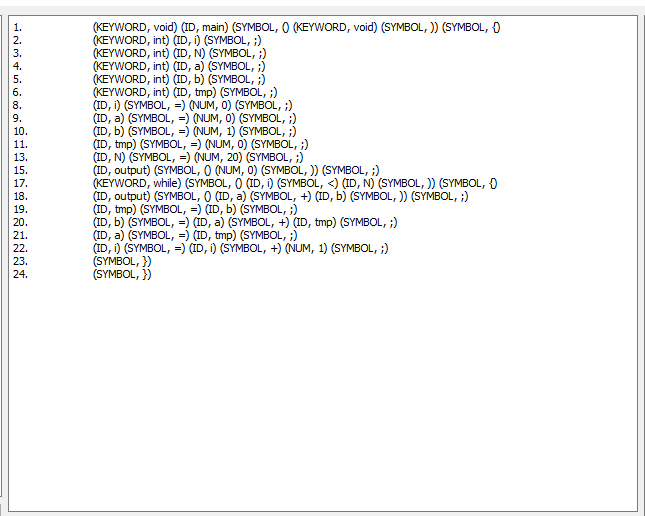
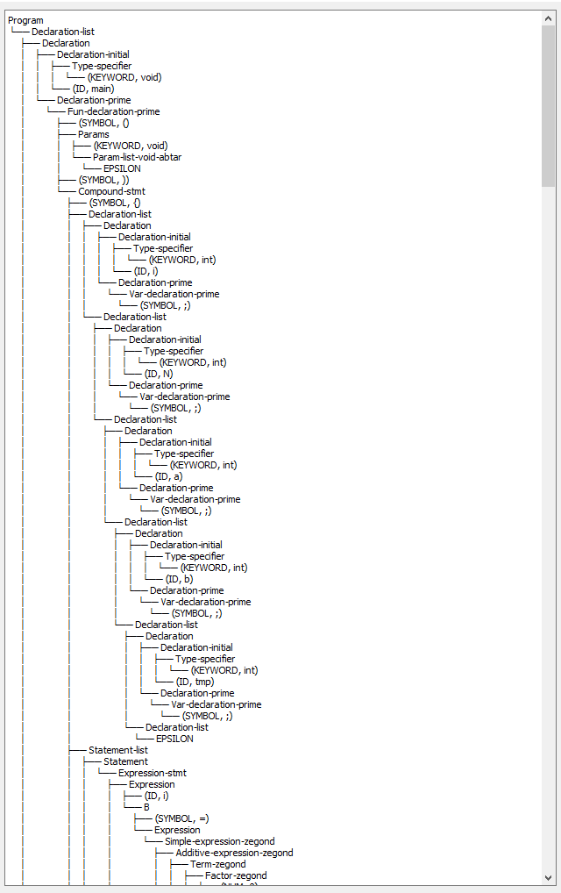
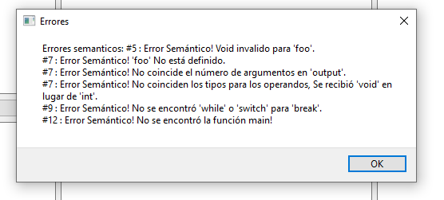
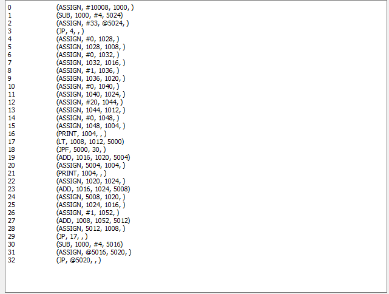
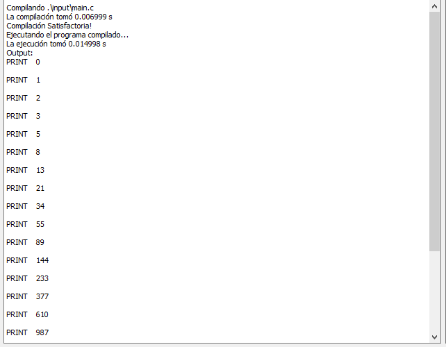
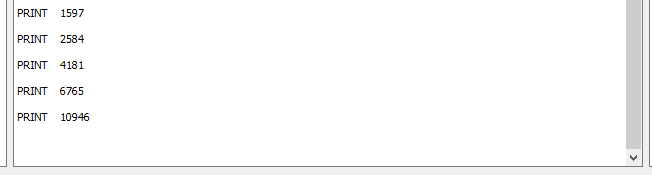

# Analizador Léxico 

El primer paso es dividir el código del programa de entrada en un grupo de unidades semánticamente significativas llamadas tokens . Intuitivamente, cada palabra y símbolo en el código fuente transmite algún significado y queremos extraer estos tokens en una lista ordenada para su posterior procesamiento.

 La salida del analizador léxico para nuestro compilador se vería así:

Los tokens se leen en el mismo orden en que se escribió el código fuente del programa, es decir, de izquierda a derecha y de arriba a abajo. Los tokens tienen diferentes tipos según su función a la hora de describir lo que hace el programa.

Entonces, en última instancia, la salida de un analizador léxico (también conocido como lexer o escáner) es una secuencia de tuplas (los números de línea solo son relevantes para informar errores). Cada tupla contiene el tipo de token y el nombre (o lexema) del token.

# Analizador Sintáctico

El analizador sintáctico (también conocido como analizador) es el corazón del compilador. Llama a los otros módulos, como el analizador léxico para buscar el siguiente token, y actúa como el bucle principal del compilador. Recibe el flujo de tokens del escáner como entrada y produce una estructura de datos llamada árbol de análisis (también conocido como árbol de sintaxis abstracta ) como salida. En el caso de nuestro ejemplo, el resultado se vería más o menos así:

# Analizador Semántico

Los módulos anteriores se han ocupado de descubrir palabras individuales y la gramática, que indica cómo unir esas palabras para que formen una oración válida de nuestro lenguaje de programación. Sin embargo, ni siquiera hemos tocado el tema de lo que realmente significan esas frases . Resulta que ese es exactamente el trabajo del analizador semántico.

Este módulo podría realizar comprobaciones arbitrariamente complicadas, pero aquí lo mantenemos simple y hacer que verifique los siguientes errores semánticos:

1. Falta la mainfunción con firma . `void main(void)` 
2. Todas las variables deben declararse en el alcance actual antes de poder usarse.
3. Las variables no pueden tener tipo `void`. 
4. Pasar el número correcto de argumentos a una función. 
5. No coinciden los tipos en operaciones binarias, por ejemplo, asignar el valor de retorno de una  función  `void` a una variable `int`. La verificación de tipos es una de las tareas más importantes de un analizador semántico para garantizar que las operaciones binarias hagan lo que deben hacer.
6. Los tipos de argumentos pasados ​​a una función deben coincidir con los tipos enumerados en la declaración de la función.

### Ejemplo de errores semánticos encontrados

En conclusión, el analizador semántico genera principalmente informes de errores para ayudar al programador a corregir sus errores. Además de eso, actualiza los tipos de identificadores en la tabla de símbolos, lo cual es un conocimiento valioso para el generador de códigos más adelante.

# Generación de Código Intermedio

El generador de código intermedio es el módulo que toma el árbol de análisis y genera una representación intermedia del código fuente. La representación intermedia es un código de nivel más bajo que el código fuente original, pero aún no es código de máquina. La representación intermedia es más fácil de analizar y transformar en código de máquina que el código fuente original.

Este módulo de generación de código consta de dos partes principales: `MemoryManager` y `CodeGen`.

**MemoryManager** gestiona la memoria para diferentes tipos de variables:
- **init**: Inicializa punteros base para memoria estática, temporal y de pila.
- **reset**: Reinicia los desplazamientos de memoria.
- **get_temp**: Devuelve una nueva dirección temporal.
- **get_static**: Devuelve una nueva dirección estática.
- **get_param_offset**: Devuelve el desplazamiento actual de un parámetro.

**CodeGen** genera el código de tres direcciones y maneja estructuras de control:
- **__init__**: Inicializa pilas semánticas y rutinas.
- **_add_three_addr_code**: Agrega código de tres direcciones al bloque del programa.
- **_resolve_addr**: Resuelve la dirección de un operando.
- **push_const_routine**: Maneja la asignación de constantes.
- **assign_routine**: Maneja la asignación de valores.
- **binary_op_routine**: Maneja operaciones binarias.
- **finish_program_routine**: Finaliza el programa, parcheando saltos.
- **while_routine**: Genera código para bucles while.
- **if_else_routine**: Genera código para estructuras if-else.

Al final se obtiene un archivo `output.txt` con el código intermedio generado el cual es ejecutado en un interprete.

### Ejemplo de código intermedio generado

# Output del Programa

