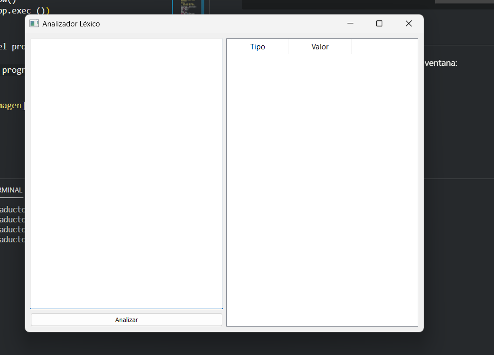
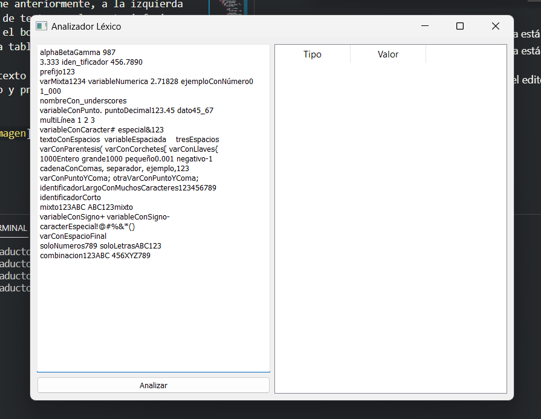
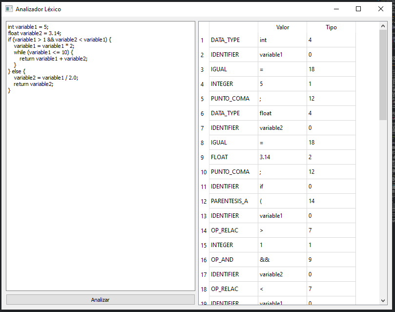

# Mini generador léxico 

## Tabla de contenidos
- [Mini generador léxico](#mini-generador-léxico)
  - [Tabla de contenidos](#tabla-de-contenidos)
  - [Introducción](#introducción)
  - [Descripción del programa](#descripción-del-programa)
    - [Clase Token y sus hijos](#clase-token-y-sus-hijos)
    - [Funciones para reconocer los tokens](#funciones-para-reconocer-los-tokens)
    - [Analizador léxico](#analizador-léxico)
    - [Interfaz gráfica](#interfaz-gráfica)
  - [Ejecución del programa](#ejecución-del-programa)

## Introducción
Este programa consiste en un pequeño **_analizadr léxico_** que reconoce los siguientes tokens:
- **Identificadores**
- **Números enteros**
- **Números reales**

Asismismo, cuando se ingresa un caracter no reconocido, el programa lo identifica como un **_error léxico_**.

el objetivo de este programa es mostrar el funcionamiento de un analizador léxico, por lo que no se incluye la parte de sintaxis ni semántica.

## Descripción del programa

### Clase Token y sus hijos

El programa esta escrito en **Python** y está orientado a objetos, por lo que se utilizan clases y herencia para su funcionamiento.

Las clases que se utilizan son las siguientes:
- **Token**: Clase padre que contiene los atributos de un token.
- **Identificador**: Clase hija que hereda los atributos de la clase Token y agrega las reglas para reconocer un identificador a través de una función.
- **Entero**: Clase hija que hereda los atributos de la clase Token y agrega las reglas para reconocer un número entero a través de una función.
- **Real**: Clase hija que hereda los atributos de la clase Token y agrega las reglas para reconocer un número real a través de una función.
- **Error**: Clase hija que hereda los atributos de la clase Token y que no agregó ninguna regla para reconocer un error léxico, ya que se utiliza para cuando se ingresa un caracter no reconocido.

En el siguiente codigo se muestra la definición de la clase Token y sus hijos:

```python
#Definimos la clase Token
class Token:
    def __init__(self, tipo, reglas=None):
        self.tipo = tipo
        self.valor = ''
        self.reglas = reglas
    
    def set_valor(self, input):
            self.valor = input
    
    def rule_check(self, input):
        return self.reglas(input)
    
    def return_token(self):
        return (self.tipo,self.valor)

#Utilizamos herencia para definir los diferentes tipos de tokens
class Identificador(Token):
    def __init__(self):
        super().__init__('identificador', es_identificador)

class Entero(Token):
    def __init__(self):
        super().__init__('entero', es_entero)

class Real(Token):
    def __init__(self):
        super().__init__('real', es_real)

class Error(Token):
    def __init__(self):
        super().__init__('error')
```
Como podemos ver cada clase hija recibe una funcion como parametro, esta funcion es la que se encarga de reconocer el token, por lo que cada clase hija tiene una funcion diferente. Este enfoque nos permite agregar nuevos tokens de una manera sencilla, ya que solo tenemos que crear una nueva clase hija y agregar la funcion que reconoce el token, además de poder agregar nuevos metodso a cada token según sea necesario.

### Funciones para reconocer los tokens

Las reglas para reconocer los tokens son las siguientes:
```python
def es_identificador(input):
    '''
    Verifica si el input contiene sólo letras y números en el orden correcto.
    En caso de que el input sea un identificador, regresa True, en caso contrario regresa False.
    '''
    if input[0].isalpha():
        for char in input[1:]:
            if not (char.isalpha() or char.isdigit()):
                return False
        return True
    return False

def es_entero(input):
    '''
    Verifica si el input contiene sólo números.
    En caso de que el input sea un número entero, regresa True, en caso contrario regresa False.
    '''
    if input[0].isdigit():
        for char in input[1:]:
            if not char.isdigit():
                return False
        return True
    return False

def es_real(input):
    '''
    Verifica si el input contiene sólo números y un sólo punto decimal intermedio.
    En caso de que el input sea un número real, regresa True, en caso contrario regresa False.
    '''
    if not input[0].isdigit():
        return False
    elif input[0].isdigit:
        pos=1
        for char in input[1:]:
            if not (char.isdigit() or char == '.'):
                return False
            elif char == '.':
                if '.' in input[pos+1:]:
                    return False
            pos += 1
        if input[-1] == '.':
            return False
        return True
```
### Analizador léxico

El analizador léxico es la parte principal del programa, ya que es la que se encarga de reconocer y clasificar los tokens. El analizador cuenta con sólo un atributo, que es el texto que se va a analizar, y con un método que se encarga de realizar el análisis léxico. El método va dividiendo el texto en tokens y cada token es clasificado a través de los métodos de las clases hijas deifnidad previamente, las cuales retornan una tupla con el tipo de token y su valor en caso de que el token cumpla con las reglas, si el token actual en el analisis no cumple con ninguna regla, se clasifica como un error léxico. Al terminar de analizar el texto, el método retorna una lista con los tokens encontrados.

El siguiente codigo muestra la definición del analizador léxico:

```python
#Definimos el analizador lexico
class AnalizadorLexico:
    def __init__(self, texto=''):
        self.texto = texto

    def obtener_tokens(self):
            """
            Esta función analiza el texto y devuelve una lista de tokens encontrados.
            
            Returns:
                list: Lista de tokens encontrados en el texto.
            """
            identificador = Identificador()
            entero = Entero()
            real = Real()
            error = Error()
            pos = 0
            tokens = []
            current_token = ''
            while pos < len(self.texto):
                char = self.texto[pos]
                if (char in ['\n', '\t', ' ']) or (pos == len(self.texto) - 1):
                    if current_token:

                        if pos == len(self.texto) - 1:
                            current_token += char

                        if identificador.rule_check(current_token):
                            identificador.set_valor(current_token)
                            tokens.append(identificador.return_token())
                        elif entero.rule_check(current_token):
                            entero.set_valor(current_token)
                            tokens.append(entero.return_token())
                        elif real.rule_check(current_token):
                            real.set_valor(current_token)
                            tokens.append(real.return_token())
                        else:
                            error.set_valor(current_token)
                            tokens.append(error.return_token())
                        current_token = ''
                else:
                    current_token += char
                pos += 1
            return tokens
```
### Interfaz gráfica

Para la interfaz gráfica se utilizó el framework **PyQt5**. Esto nos permite una mejor interacción con el programa para facilitar las pruebas y añadir nuevas funcionalidades conforme avancemos en el desarrollo del compilador.

Estas son las librerias que se utilizaron para la interfaz gráfica:
```python
from PyQt5.QtWidgets import QApplication, QMainWindow, QTextEdit, QTableWidget, QTableWidgetItem, QVBoxLayout, QHBoxLayout, QPushButton, QWidget
import sys
```

Mi intención es permitirle tener al usuario una experiencia los más cercana a manejar un editor de texto con un compilador integrado, por lo que la interfaz gráfica cuenta con las siguientes funcionalidades:
- **Editor de texto**: El usuario puede escribir el texto que desea analizar en un editor de texto. Este se encuentra en la parte izquierda de la ventana. 
- **Botón de análisis**: El usuario puede analizar el texto ingresado en el editor de texto al presionar el botón de análisis. Este se encuentra en la parte inferior izquierda de la ventana.
- **Tabla de tokens**: El usuario puede ver los tokens encontrados en el texto en una tabla. Esta se encuentra en la parte derecha de la ventana. a futuro se planea agregar las funcionalidades correspondientes a un compilador en esta parte de la ventana.

El siguiente codigo muestra la definición de la interfaz gráfica:

```python
#Definimos la interfaz grafica   
class MainWindow(QMainWindow):
    def __init__(self):
        super().__init__()
        self.initUI()

    def initUI(self):
        self.setWindowTitle("Analizador Léxico")
        self.setGeometry(100, 100, 800, 600)

        # Layouts
        layout = QHBoxLayout()
        leftLayout = QVBoxLayout()
        rightLayout = QVBoxLayout()

        # Componentes
        self.textEdit = QTextEdit()
        self.analyzeButton = QPushButton("Analizar")
        self.analyzeButton.clicked.connect(self.analyzeText) # Conectar el evento click del botón con el método analyzeText

        self.tokensTable = QTableWidget()
        self.tokensTable.setColumnCount(2)
        self.tokensTable.setHorizontalHeaderLabels(["Tipo", "Valor"])

        # Añadir componentes a los layouts
        leftLayout.addWidget(self.textEdit)
        leftLayout.addWidget(self.analyzeButton)

        rightLayout.addWidget(self.tokensTable)

        layout.addLayout(leftLayout)
        layout.addLayout(rightLayout)

        # Contenedor central
        centralWidget = QWidget()
        centralWidget.setLayout(layout)
        self.setCentralWidget(centralWidget)

    def analyzeText(self):
        """
        Analiza el texto ingresado en el widget de texto y muestra los tokens en una tabla.
        """
        text = self.textEdit.toPlainText() # Obtenemos el texto del widget de texto
        analizador = AnalizadorLexico(text) # Creamos una instancia del analizador léxico con el texto ingresado
        tokens = analizador.obtener_tokens() # Obtenemos los tokens del analizador léxico

        self.tokensTable.setRowCount(len(tokens))

        # Mostramos los tokens en la tabla
        for i, token in enumerate(tokens):
            tipo = QTableWidgetItem(token[0])
            valor = QTableWidgetItem(token[1])

            self.tokensTable.setItem(i, 0, tipo)
            self.tokensTable.setItem(i, 1, valor)

#Ejecutamos la interfaz grafica
if __name__ == '__main__':
    app = QApplication(sys.argv)
    mainWin = MainWindow()
    mainWin.show()
    sys.exit(app.exec_())
```

## Ejecución del programa

Al ejecutar el programa se muestra la siguiente ventana:



Como lo mencione anteriormente, a la izquierda está el editor de texto, en la parte inferior izquierda está el botón de análisis y a la derecha está la tabla de tokens.

Ingresamos el texto que queremos analizar en el editor de texto y presionamos el botón de análisis:



Ahora despues de presionar el botón de análisis, podemos ver los tokens encontrados en la tabla de tokens: 



Como podemos ver, el programa reconoce todos los tokens que cumplan con las reglas definidas previamente, en caso de que se ingrese un caracter no reconocido, el programa lo identifica como un error léxico.