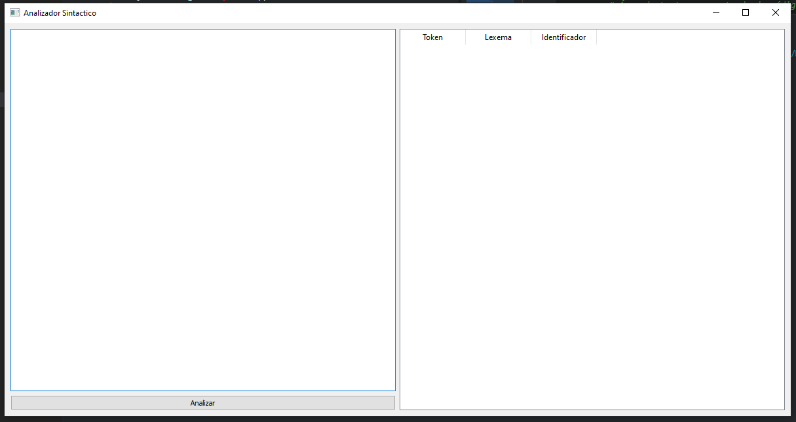
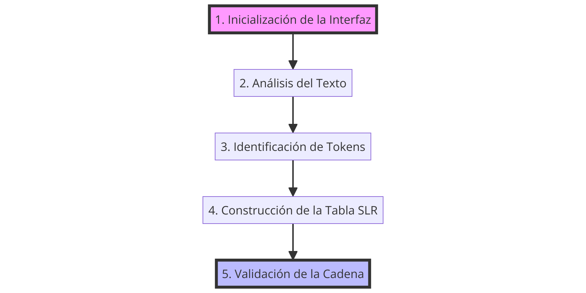
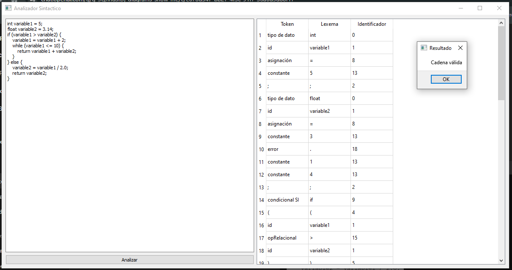
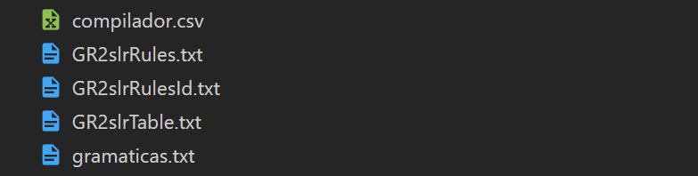

# Analizador Sintáctico

## Introducción

Este programa está diseñado para realizar análisis sintáctico de un código fuente, identificando los tokens y estructuras gramaticales presentes en el código. Este análisis se efectúa mediante la técnica de análisis sintáctico LR(0), específicamente utilizando una tabla SLR para guiar el proceso de análisis.

## Diseño del Programa

El programa se estructura alrededor de la clase `Tokenizer`, la cual hereda de `QMainWindow` de PyQt para proporcionar una interfaz gráfica de usuario (GUI) que facilita la interacción con el usuario. La interfaz consta de un área de texto para la entrada del código fuente, un botón para iniciar el análisis, y una tabla para mostrar los tokens identificados junto con sus respectivos lexemas e identificadores.

### Código de la Interfaz Gráfica

```python
class Tokenizer(QMainWindow):
    def __init__(self):
        super().__init__()
        self.initUI()

    def initUI(self):
        self.setWindowTitle('Analizador Sintactico')
        self.setGeometry(100, 100, 1200, 600)

        # Layout principal
        h_layout = QHBoxLayout()
        v_layout = QVBoxLayout()

        # Área de texto para entrada de código
        self.textEdit = QTextEdit()
        v_layout.addWidget(self.textEdit)

        # Botón para analizar el texto
        self.btnAnalyze = QPushButton('Analizar')
        self.btnAnalyze.clicked.connect(self.analyzeText)
        v_layout.addWidget(self.btnAnalyze)

        # Tabla para mostrar los tokens
        self.tableWidget = QTableWidget()
        self.tableWidget.setColumnCount(3)
        self.tableWidget.setHorizontalHeaderLabels(['Token', 'Lexema', 'Identificador'])
        h_layout.addLayout(v_layout)
        h_layout.addWidget(self.tableWidget)

        # Widget contenedor y set layout
        container = QWidget()
        container.setLayout(h_layout)
        self.setCentralWidget(container)
```

### Interfaz Gráfica



### Componentes de la GUI

- **Área de texto (QTextEdit):** Permite al usuario ingresar el código fuente que será analizado.
- **Botón de análisis (QPushButton):** Inicia el proceso de análisis del texto ingresado.
- **Tabla de tokens (QTableWidget):** Muestra los resultados del análisis, incluyendo los tokens, los lexemas asociados, y sus identificadores.

### Flujo de Ejecución



1. **Inicialización de la Interfaz:** Al iniciar el programa, se configura la ventana principal, incluyendo el título, dimensiones, y los componentes de la GUI.
2. **Análisis del Texto:** Al presionar el botón 'Analizar', se invoca el método `analyzeText`, el cual realiza el análisis léxico y sintáctico del texto ingresado.
3. **Identificación de Tokens:** El análisis se lleva a cabo mediante un autómata finito que reconoce los tokens válidos y sus lexemas, asignándoles identificadores únicos.
4. **Construcción de la Tabla SLR:** Se utiliza una tabla SLR, cargada desde archivos externos, para guiar el proceso de análisis sintáctico mediante desplazamientos y reducciones.
5. **Validación de la Cadena:** El programa determina si la cadena ingresada es válida o inválida conforme a la gramática definida, mostrando el resultado mediante un cuadro de diálogo.



## Decisiones de Implementación

### Manejo de Errores Léxicos y Sintácticos

El programa está diseñado para identificar y manejar errores léxicos y sintácticos de la siguiente manera:

- **Errores Léxicos:** Se consideran errores léxicos aquellos caracteres o secuencias de caracteres que no se corresponden con ningún token válido de la gramática. Estos son identificados durante el análisis léxico y se les asigna el token 'error'.
- **Errores Sintácticos:** Se detectan mediante la tabla SLR cuando no existe una acción definida para el estado actual y el token entrante. En tal caso, se muestra un mensaje indicando que la cadena es inválida.

### Uso de Tablas SLR Externas

La decisión de utilizar archivos externos para cargar las reglas y la tabla SLR permite una mayor flexibilidad en el análisis sintáctico, facilitando la modificación de la gramática sin necesidad de alterar el código del programa.

